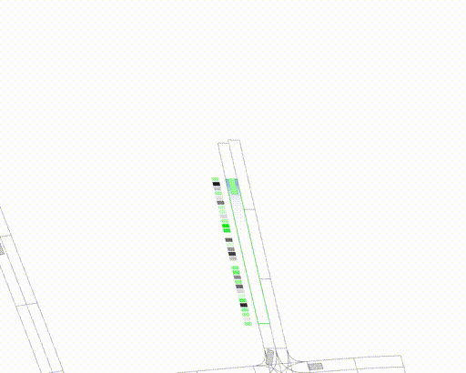

# Introduction

**commonroad-geometric (crgeo)** is a Python framework that facilitates deep-learning based research projects in the autonomous driving domain, e.g. related to behavior planning and state representation learning.

At its core, it provides a standardized interface for heterogeneous graph representations of traffic scenes using the [PyTorch-Geometric](https://pytorch-geometric.readthedocs.io/en/latest/) framework.

The package aims to serve as a flexible framework that, without putting restrictions on potential research directions, minimizes the time spent on implementing boilerplate code. Through its object-oriented design with highly flexible and extendable class interfaces, it is meant to be imported via **pip install** and utilized in a plug-and-play manner.
<!--
---

|||
| ---      | ---       |
|||


--- -->

## Highlighted features

- A framework for [PyTorch Geometric-based](https://pytorch-geometric.readthedocs.io/) heterogeneous graph data extraction from traffic scenes and road networks supporting user-made feature computers and edge drawers.
- Built-in functionality for collection and storing of graph-based traffic datasets as [PyTorch datasets](https://pytorch.org/vision/stable/datasets.html).
- Fully customizable live rendering support for showcasing and debugging.
- The extension [Commonroad-Geometric-Learning](https://github.com/CommonRoad/crgeo-learning) offers high-level Python infrastructure code for training graph neural networks using this package.


<!-- --- -->

<!-- ## High-level package architecture


 -->

---


# Getting started

The easiest way of getting familiar with the framework is to consult the [tutorial directory](tutorials), which contains a multitude of simple application demos that showcase the intended usage of the package.

### Research guidelines:

- It is highly recommended to incorporate the package's extendable rendering capabilities as an integral part of your development workflow. This allows you to visualize what is going on in your experiment, greatly simplifying debugging efforts.
- If you ever find yourself in a situation where you have to modify the internals of this package while working on your research project, it probably means that commonroad-geometric is not flexible enough - please create a corresponding issue.

### Design principles and developer guidelines:

- Frequent use of abstraction classes for a modular and clean framework.
- Class interfaces should be understandable and well-documented. We use the Google style docstring format across the package (see [PyCharm](https://www.jetbrains.com/help/pycharm/creating-documentation-comments.html), [VSCode](https://github.com/NilsJPWerner/autoDocstring)).
- As a general rule, everything should be configurable and externalized through class APIs. While ensuring flexibility, however, make sure to provide reasonable defaults for most things to avoid unnecessary overhead for users.
- Add tutorial scripts to the `tutorials/` directory for easy testing, reviewing and showcasing of new functionality.
- Use [type hinting](https://docs.python.org/3/library/typing.html) everywhere - it enhances readability and makes the IDE developer experience a lot smoother. Perform [static type checking](https://gitlab.lrz.de/cps/commonroad-geometric/-/wikis/Static-Type-Checking-with-Mypy) with [mypy](https://github.com/python/mypy) (`pip install mypy` + `/commonroad-geometric$ mypy`) for easily discovering inconsistent typing (see [PyCharm extension](https://plugins.jetbrains.com/plugin/11086-mypy), [VS Code extension](https://marketplace.visualstudio.com/items?itemName=matangover.mypy)).
- Create issues for new tasks with appropriate priority and category labels as well as a corresponding branch.  Create a merge request to the develop branch afterwards.
- Adhere to [PEP8](https://www.python.org/dev/peps/pep-0008/).

---

# Installation

The installation script [`scripts/create-dev-environment.sh`](scripts/create-dev-environment.sh) installs the commonroad-geometric package and all its dependencies into a conda environment:

Execute the script inside the directory which you want to use for your development environment.

Note: make sure that the CUDA versions are compatible with your setup.


### Note: Headless rendering
If you want to export the rendering frames without the animation window popping up, please use the command given below.
``` shell
echo "export PYGLET_HEADLESS=..." >> ~/.bashrc
```
You can replace `.bashrc` with `.zshrc`, if you use `zsh`

---
