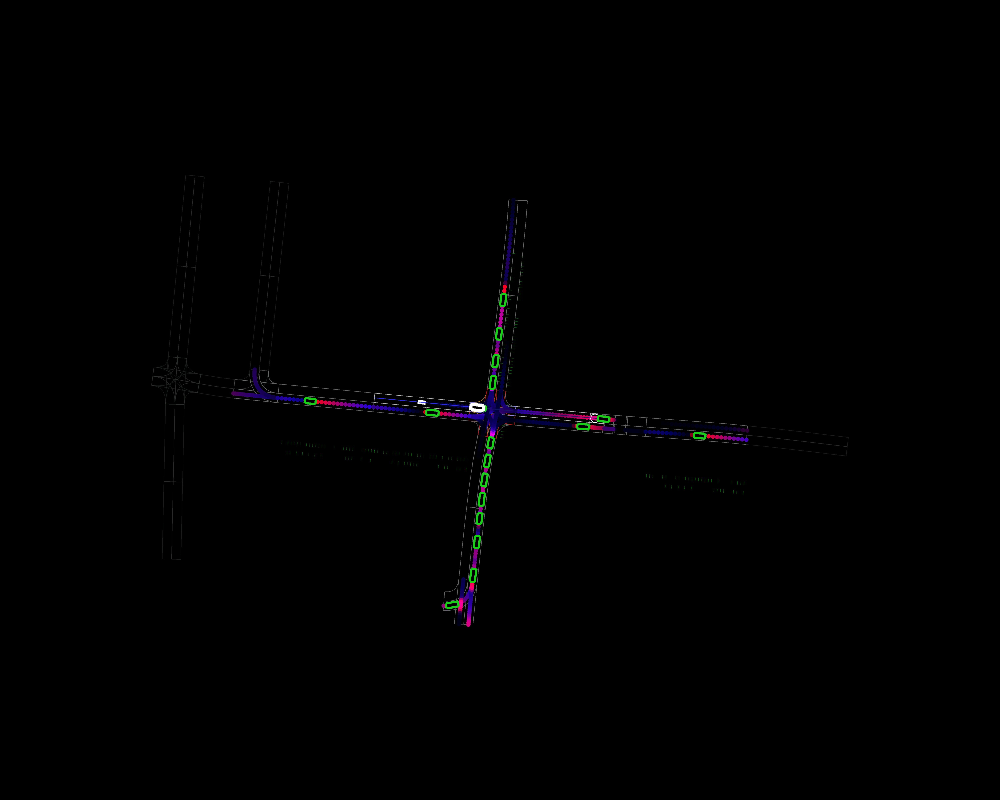
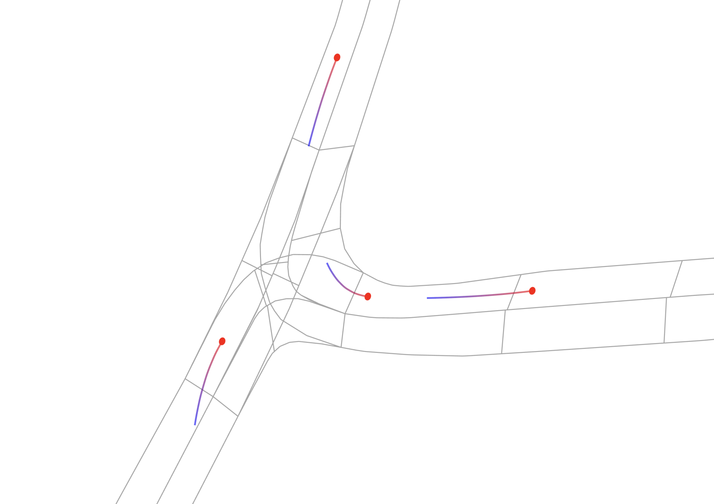
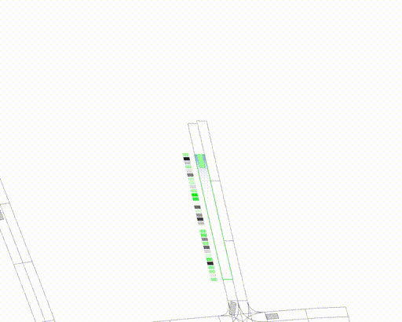

.. _gallery:

============================
Gallery
============================

------------

Images
-----------

------------

-----------
Lanelet occupancy prediction
-----------

|
------------

-----------
Trajectory prediction
-----------

------------

Videos
-----------

------------

-----------
Vehicle-to-vehicle edges
-----------
.. image:: img/sumo_sim_1.gif
   :width: 800

|
------------

-----------
Occupancy-reconstructive representation learning
-----------

|
------------

-----------
Vehicle-temporal-vehicle edges
-----------
.. image:: img/sumo_sim_temporal_1.gif
   :width: 800

|
------------

-----------
Drivable area-reconstructive representation learning
-----------
.. image:: img/DEU_Munich-1_104-step-0-to-step-400.gif
   :width: 800

|
------------

-----------
Lanelet occupancy model during training
-----------
.. image:: img/occupancy_predictive_training.gif
   :width: 800
