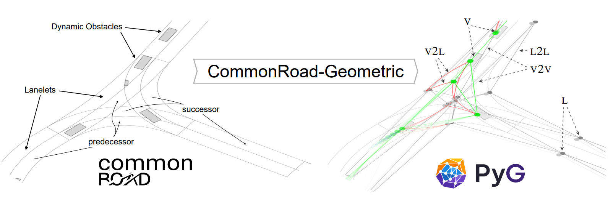

CommonRoad-Geometric
==========================

*commonroad-geometric (crgeo)* is a Python framework that facilitates deep-learning based research projects in the autonomous driving domain, e.g. related to behavior planning and trajectory prediction.
At its core, it provides a standardized interface for heterogeneous graph representations of traffic scenes using the `PyTorch-Geometric <https://pytorch-geometric.readthedocs.io/en/latest/>`_ framework.

The package aims to serve as a flexible framework that, without putting restrictions on potential research directions, minimizes the time spent on implementing boilerplate code. Through its object-oriented design with highly flexible and extendable class interfaces, it is meant to be imported via pip install and utilized in a plug-and-play manner.

.. The software is written in Python and tested on Linux for the Python 3.8, 3.9, 3.10, and 3.11.

Installation
============

commonroad-geometric can be installed with:: 

	pip install crgeo

Alternatively, clone from our gitlab repository::

	git clone https://github.com/CommonRoad/crgeo

and add the folder crgeo to your Python environment.

The installation script `create-dev-environment.sh <https://github.com/CommonRoad/crgeo/blob/main/scripts/create-dev-environment.sh>`_ installs the commonroad-geometric package and all its dependencies into a conda environment.
Execute the script inside the directory which you want to use for your development environment.

Getting Started
============================

A tutorial on the main functionalities of the project is :ref:`available here<getting_started>`.

.. toctree::
   :maxdepth: 2
   :caption: Contents:

   user/index.rst
   api/index.rst
   gallery.rst

.. Indices and tables
.. ===============================

.. * :ref:`genindex`
.. * :ref:`modindex`
.. * :ref:`search`

Authors
============

Eivind Meyer, Maurice Brenner, Bowen Zhang, Max Schickert, Bilal Musani

Contact information
================================

:Website: `http://commonroad.in.tum.de <https://commonroad.in.tum.de/>`_
:Email: `commonroad@lists.lrz.de <commonroad@lists.lrz.de>`_